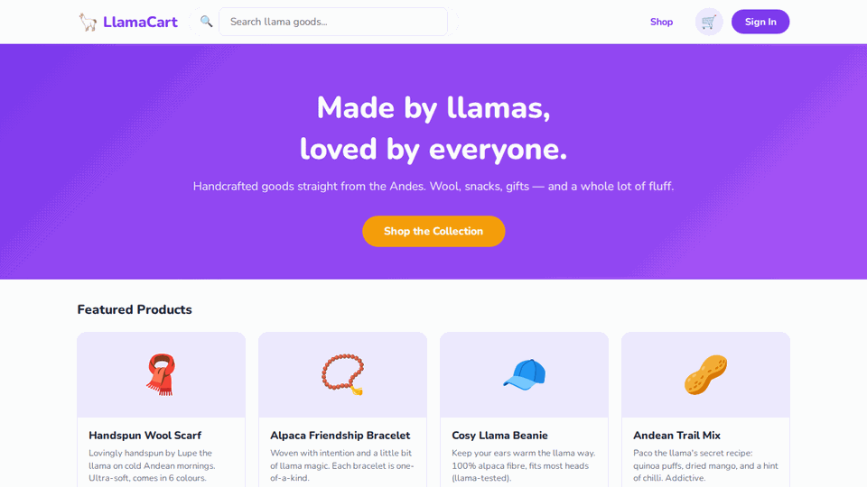

# 🦙 LlamaCart — Playwright E2E Tutorial

> A hands-on Playwright tutorial built around **LlamaCart**, a fictional handmade goods store run by llamas. Learn end-to-end testing from zero to CI/CD.

---



---

## What's inside

| Chapter | Topic | What you'll learn |
|---|---|---|
| [01-basics](tests/01-basics/README.md) | Your first tests | `goto`, `click`, `fill`, basic assertions |
| [02-locators](tests/02-locators/README.md) | Finding elements | `getByRole`, `getByLabel`, `getByTestId`, `filter` |
| [03-fixtures-and-pom](tests/03-fixtures-and-pom/README.md) | Page Object Model | Reusable page classes, custom fixtures |
| [04-api-and-network](tests/04-api-and-network/README.md) | Network & API testing | `page.route()`, request interception, HAR files |
| [05-auth-state](tests/05-auth-state/README.md) | Auth state | `storageState`, log in once across all tests |
| [06-visual-testing](tests/06-visual-testing/README.md) | Visual regression | `toHaveScreenshot`, baselines, masking, thresholds |
| [07-ci-cd](tests/07-ci-cd/README.md) | CI/CD patterns | Tags, sharding, retry-safe assertions, `test.slow` |

---

## The app — LlamaCart

LlamaCart is a small e-commerce store selling llama-made goods: wool scarves, alpaca snacks, friendship bracelets, and more. It's built with plain HTML + Vanilla JS + Vite — no framework needed, easy to run anywhere.


**Features tested:**
- Product listing with search and category filters
- Product detail pages
- Shopping cart (add, remove, quantity controls)
- Login / register flow
- Order checkout

---

## Quick start

### Prerequisites
- Node.js 18+
- npm

### Install everything

```bash
git clone https://github.com/YOUR_USERNAME/llamacart-playwright-tutorial
cd llamacart-playwright-tutorial

# Install Playwright
npm install

# Install webapp dependencies
cd webapp && npm install && cd ..

# Install browser binaries
npx playwright install
```

### Run the app

```bash
npm run dev
# Webapp runs at http://localhost:5173
```

### Run the tests

```bash
# All tests, all browsers
npm test

# Just Chromium (faster for development)
npm run test:chromium

# Interactive UI mode — great for debugging
npm run test:ui

# Headed mode — watch the browser
npm run test:headed

# View the HTML report after a run
npm run test:report
```

---

## Project structure

```
llamacart-playwright-tutorial/
├── playwright.config.ts        # Test configuration
├── webapp/                     # The LlamaCart web app
│   ├── index.html
│   └── src/data/products.js
├── tests/
│   ├── 01-basics/
│   ├── 02-locators/
│   ├── 03-fixtures-and-pom/
│   │   └── pages/              # Page Object Model classes
│   ├── 04-api-and-network/
│   ├── 05-auth-state/
│   ├── 06-visual-testing/
│   │   └── visual.spec.ts-snapshots/   # Baseline screenshots
│   └── 07-ci-cd/
└── .github/workflows/
    └── playwright.yml
```


---

## Contributing

Found a bug? Want to add a chapter? PRs welcome!

---

*Made with ❤️ and a little llama magic.*
