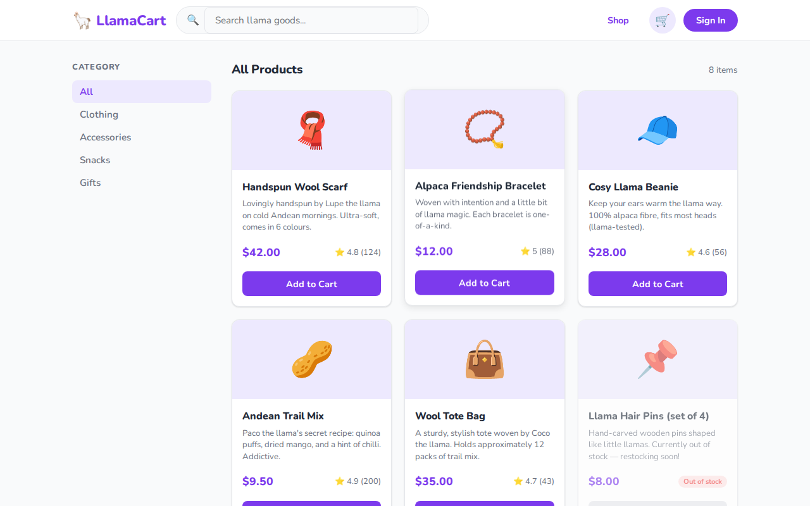

# 🦙 LlamaCart — Playwright E2E Tutorial

> A hands-on [Playwright](https://playwright.dev) tutorial built around **LlamaCart**, a fictional handmade goods store run by llamas. Learn end-to-end testing from zero to CI/CD.

---

<video src="tests/01-basics/assets/demo.mp4" autoplay loop muted playsinline width="100%"></video>

---

## What is Playwright?

[Playwright](https://playwright.dev) is an open-source end-to-end testing framework by Microsoft. It drives real browsers — Chrome, Firefox, and Safari — through a single, unified API, letting you write tests once and verify them across every major engine.

### Core components

| Component | What it does | Docs |
|---|---|---|
| [**Test runner**](https://playwright.dev/docs/running-tests) | Discovers, runs, and reports tests. Supports parallelism, retries, tagging, and sharding out of the box. | `npx playwright test` |
| [**Browser contexts**](https://playwright.dev/docs/browser-contexts) | Lightweight, isolated browser sessions — like incognito windows. Each test gets its own context so state never leaks between tests. | `browser.newContext()` |
| [**Page**](https://playwright.dev/docs/pages) | The object you interact with in every test: navigate, click, fill, assert. One page per browser tab. | `context.newPage()` |
| [**Locators**](https://playwright.dev/docs/locators) | Smart element queries that auto-wait and auto-retry. Preferred over raw CSS/XPath selectors. | `page.getByRole()`, `getByTestId()` |
| [**Network layer**](https://playwright.dev/docs/network) | Intercept, stub, abort, or modify any HTTP request your app makes — no proxy needed. | `page.route()` |
| [**Fixtures**](https://playwright.dev/docs/test-fixtures) | Dependency injection for tests: share pages, auth state, or any custom setup/teardown across a suite. | `test.extend()` |
| [**Codegen**](https://playwright.dev/docs/codegen) | Record browser interactions and emit test code automatically. | `npx playwright codegen` |
| [**Trace viewer**](https://playwright.dev/docs/trace-viewer) | A full timeline of any test run: DOM snapshots, network calls, console logs, and screenshots. | `npx playwright show-trace` |
| [**UI mode**](https://playwright.dev/docs/test-ui-mode) | Interactive watch mode with a built-in test explorer, time-travel debugging, and live re-runs. | `npx playwright test --ui` |
| [**Visual comparisons**](https://playwright.dev/docs/test-snapshots) | Pixel-level screenshot diffing with configurable thresholds and masking. | `expect(page).toHaveScreenshot()` |

### Cross-browser support

Playwright ships its own builds of every browser engine — you never depend on whatever the OS has installed.

| Browser | Engine | Install |
|---|---|---|
| [Chrome / Edge](https://playwright.dev/docs/browsers#chromium) | Chromium | `npx playwright install chromium` |
| [Firefox](https://playwright.dev/docs/browsers#firefox) | Gecko | `npx playwright install firefox` |
| [Safari](https://playwright.dev/docs/browsers#webkit) | WebKit | `npx playwright install webkit` |

Each engine can also be run in **mobile emulation** mode (Pixel 7, iPhone 14, etc.) using [device descriptors](https://playwright.dev/docs/emulation#devices), giving you viewport, user-agent, and touch events for free.

### Language support

The same test concepts are available in multiple languages — pick the one that fits your stack:

| Language | Package |
|---|---|
| TypeScript / JavaScript | [`@playwright/test`](https://www.npmjs.com/package/@playwright/test) |
| Python | [`playwright`](https://pypi.org/project/playwright/) (pytest plugin: `pytest-playwright`) |
| Java | [`playwright`](https://mvnrepository.com/artifact/com.microsoft.playwright/playwright) |
| C# | [`Microsoft.Playwright`](https://www.nuget.org/packages/Microsoft.Playwright) |

Official docs: [playwright.dev/docs/intro](https://playwright.dev/docs/intro)

---

## What's inside

| Chapter | Topic | What you'll learn |
|---|---|---|
| [01-basics](tests/01-basics/README.md) | Your first tests | `goto`, `click`, `fill`, basic assertions |
| [02-locators](tests/02-locators/README.md) | Finding elements | `getByRole`, `getByLabel`, `getByTestId`, `filter` |
| [03-fixtures-and-pom](tests/03-fixtures-and-pom/README.md) | Page Object Model | Reusable page classes, custom fixtures |
| [04-api-and-network](tests/04-api-and-network/README.md) | Network & API testing | `page.route()`, request interception, HAR files |
| [05-auth-state](tests/05-auth-state/README.md) | Auth state | `storageState`, log in once across all tests |
| [06-visual-testing](tests/06-visual-testing/README.md) | Visual regression | `toHaveScreenshot`, baselines, masking, thresholds |
| [07-ci-cd](tests/07-ci-cd/README.md) | CI/CD patterns | Tags, sharding, retry-safe assertions, `test.slow` |

---

## The app — LlamaCart

LlamaCart is a small e-commerce store selling llama-made goods: wool scarves, alpaca snacks, friendship bracelets, and more. It's built with plain HTML + Vanilla JS + Vite — no framework needed, easy to run anywhere.



**Features tested:**
- Product listing with search and category filters
- Product detail pages
- Shopping cart (add, remove, quantity controls)
- Login / register flow
- Order checkout

---

## Quick start

### Prerequisites
- Node.js 18+
- npm

### Install everything

```bash
git clone https://github.com/YOUR_USERNAME/llamacart-playwright-tutorial
cd llamacart-playwright-tutorial

# Install Playwright
npm install

# Install webapp dependencies
cd webapp && npm install && cd ..

# Install browser binaries
npx playwright install
```

### Run the app

```bash
npm run dev
# Webapp runs at http://localhost:5173
```

### Run the tests

```bash
# All tests, all browsers
npm test

# Just Chromium (faster for development)
npm run test:chromium

# Interactive UI mode — great for debugging
npm run test:ui

# Headed mode — watch the browser
npm run test:headed

# View the HTML report after a run
npm run test:report
```

---

## Project structure

```
llamacart-playwright-tutorial/
├── playwright.config.ts        # Test configuration
├── webapp/                     # The LlamaCart web app
│   ├── index.html
│   └── src/data/products.js
├── tests/
│   ├── 01-basics/
│   ├── 02-locators/
│   ├── 03-fixtures-and-pom/
│   │   └── pages/              # Page Object Model classes
│   ├── 04-api-and-network/
│   ├── 05-auth-state/
│   ├── 06-visual-testing/
│   │   └── visual.spec.ts-snapshots/   # Baseline screenshots
│   └── 07-ci-cd/
└── .github/workflows/
    └── playwright.yml
```


---

## Upcoming

| Feature | Status |
|---|---|
| Full end-to-end scenario — a single test file that drives every feature of LlamaCart from landing page to order confirmation | Planned |
| Python version of the full tutorial (pytest-playwright) | Planned |

---

## Contributing

Found a bug? Want to add a chapter? PRs welcome!

---

*Made with ❤️ and a little llama magic.*
