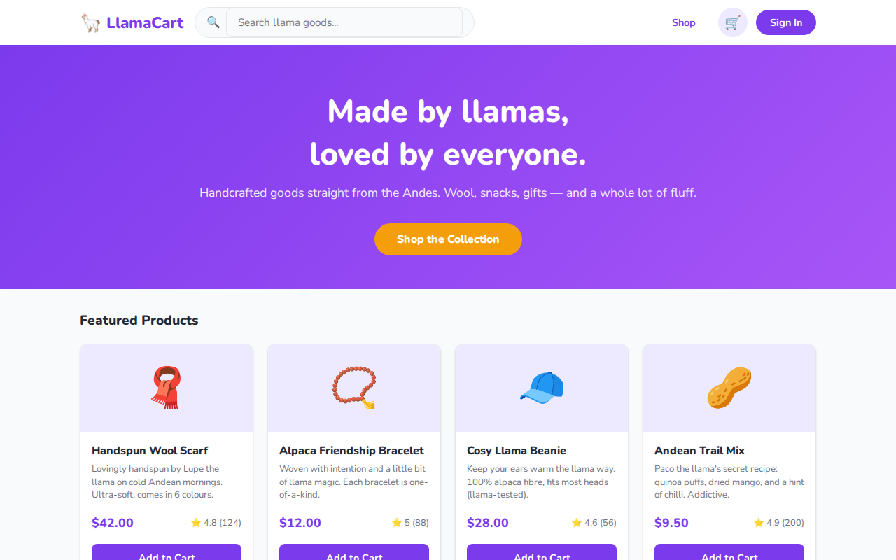

# 🦙 Chapter 1 — Your First Playwright Tests

> From zero to running tests in minutes.

## What you'll learn

- Navigating to a page with [`page.goto()`](https://playwright.dev/docs/api/class-page#page-goto)
- Asserting the page title with [`expect(page).toHaveTitle()`](https://playwright.dev/docs/api/class-pageassertions#page-assertions-to-have-title)
- Finding elements by role with [`getByRole()`](https://playwright.dev/docs/api/class-page#page-get-by-role)
- Finding elements by test ID with [`getByTestId()`](https://playwright.dev/docs/api/class-page#page-get-by-test-id)
- Asserting visibility with [`toBeVisible()`](https://playwright.dev/docs/api/class-locatorassertions#locator-assertions-to-be-visible)
- Counting elements with [`toHaveCount()`](https://playwright.dev/docs/api/class-locatorassertions#locator-assertions-to-have-count)
- Partial text matching with [`toContainText()`](https://playwright.dev/docs/api/class-locatorassertions#locator-assertions-to-contain-text)
- Typing into inputs with [`fill()`](https://playwright.dev/docs/api/class-locator#locator-fill)
- Reading element text with [`textContent()`](https://playwright.dev/docs/api/class-locator#locator-text-content)

## Prerequisites

- Node.js 18+
- Repo cloned and dependencies installed (`npm install` at root, `cd webapp && npm install`)
- Playwright browsers installed (`npx playwright install`)

See the [root README](../../README.md) for full setup instructions.

## Running the tests

```bash
# Run Chapter 1 on Chromium only (fastest)
npx playwright test tests/01-basics --project=chromium

# Run with the interactive UI — great for exploring step by step
npx playwright test tests/01-basics --ui
```

## The app under test

LlamaCart is a small e-commerce store selling handcrafted llama goods — wool scarves, alpaca snacks, friendship bracelets, and more. It's built with vanilla HTML + JavaScript and served by Vite.



The shop lists all 8 products with category filters and a live search bar.


> **Note — single-page app:** LlamaCart is an SPA. All navigation happens by toggling CSS classes in JavaScript — the URL stays at `/` throughout. Our tests always start with `page.goto('/')` and interact with in-app controls from there.

---

## Test walkthrough

### Test 1 — "homepage loads with correct title"

```typescript
test('homepage loads with correct title', async ({ page }) => {
  await page.goto('/');
  await expect(page).toHaveTitle(/LlamaCart/);
});
```

[`page.goto('/')`](https://playwright.dev/docs/api/class-page#page-goto) navigates the browser to the base URL defined in `playwright.config.ts` (`http://localhost:5173`). Playwright waits for the page to load before moving on. `/i` denotes case insensitive matching of the provided name.

[`expect(page).toHaveTitle()`](https://playwright.dev/docs/api/class-pageassertions#page-assertions-to-have-title) asserts the `<title>` element. Passing a **regex** (`/LlamaCart/`) means the title only needs to *contain* "LlamaCart" — useful when titles include extra text like "LlamaCart 🦙".

---

### Test 2 — "homepage shows the hero heading"

```typescript
test('homepage shows the hero heading', async ({ page }) => {
  await page.goto('/');
  await expect(page.getByRole('heading', { name: /Made by llamas/i })).toBeVisible();
});
```

[`getByRole('heading', { name: ... })`](https://playwright.dev/docs/api/class-page#page-get-by-role) is the **accessibility-first** way to find headings — it maps directly to [ARIA roles](https://developer.mozilla.org/en-US/docs/Web/Accessibility/ARIA/Roles) and matches what screen readers see. Note: The `i` flag on the regex makes the match case-insensitive, so the test stays green even if the copy changes capitalisation.

[`toBeVisible()`](https://playwright.dev/docs/api/class-locatorassertions#locator-assertions-to-be-visible) checks the element is in the DOM, not hidden via `display: none` / `visibility: hidden`, and has non-zero dimensions.

#### Assignment — make Test 2 fail

`toBeVisible()` is only useful if it can actually catch hidden elements. Let's verify that by hiding the hero heading and watching the test go red.

1. Open [webapp/index.html](../../webapp/index.html).
2. Find the `<h1>` inside the `.hero` div (around line 325).
3. Add an inline style so the element is hidden from the page.
4. Run just Test 2 and confirm it fails:
   ```bash
   npx playwright test tests/01-basics --project=chromium -g "homepage shows the hero heading"
   ```
5. Revert your change and re-run to confirm it goes green again.

<details>
<summary>Solution</summary>

**Change to make in `webapp/index.html`:**

Find this line (~325):

```html
<h1>Made by llamas,<br>loved by everyone.</h1>
```

Add `style="display: none"` to hide it:

```html
<h1 style="display: none">Made by llamas,<br>loved by everyone.</h1>
```

`toBeVisible()` treats `display: none` as not visible, so the assertion fails with:

```
Error: Locator: getByRole('heading', { name: /Made by llamas/i })
expect(locator).toBeVisible()

Received: <h1 style="display: none">…</h1> — element is not visible
```

**Run the specific test:**

```bash
npx playwright test tests/01-basics --project=chromium -g "homepage shows the hero heading"
```

**To restore:** remove the `style="display: none"` attribute and re-run — the test should pass again.

</details>

---

### Test 3 — 'clicking "Shop the Collection" navigates to the shop'

```typescript
test('clicking "Shop the Collection" navigates to the shop', async ({ page }) => {
  await page.goto('/');
  await page.getByTestId('hero-shop-btn').click();
  await expect(page.getByTestId('product-card').first()).toBeVisible();
});
```

[`getByTestId('hero-shop-btn')`](https://playwright.dev/docs/api/class-page#page-get-by-test-id) finds an element by its `data-testid` attribute. Test IDs are **stable** — they don't change with copy edits or style tweaks, which makes tests less brittle.

After [`click()`](https://playwright.dev/docs/api/class-locator#locator-click), the SPA swaps pages via JavaScript. Playwright transparently handles this: `toBeVisible()` will retry until the product card appears or the test times out.

---

### Test 4 — "product cards are visible in the shop"

```typescript
test('product cards are visible in the shop', async ({ page }) => {
  await page.goto('/');
  await page.getByTestId('hero-shop-btn').click();
  const cards = page.getByTestId('product-card');
  await expect(cards).toHaveCount(8); // all 8 products
});
```

`getByTestId('product-card')` returns a **[locator](https://playwright.dev/docs/locators)** that matches *all* elements with `data-testid="product-card"` — not just the first one.

[`toHaveCount(8)`](https://playwright.dev/docs/api/class-locatorassertions#locator-assertions-to-have-count) asserts that exactly 8 elements match. If a product is accidentally removed from the data source, or a render bug hides some cards, this assertion catches it. Playwright retries the count check automatically until it passes or the timeout expires.

#### Assignment — catch a wrong count

Change `toHaveCount(8)` to `toHaveCount(9)` in the spec and run the test:

```bash
npx playwright test tests/01-basics --project=chromium -g "product cards are visible in the shop"
```

Read the failure message carefully — Playwright tells you both the expected count and the actual count it found. Then restore the correct value and re-run.

<details>
<summary>Solution</summary>

The test will fail with something like:

```
Error: expect(locator).toHaveCount(expected)

Expected: 9
Received: 8
```

Playwright's error message always shows expected vs received, which makes it easy to diagnose whether the product data, a filter, or the assertion itself is wrong. Restore `toHaveCount(8)` to fix the test.

</details>

---

### Test 5 — "each product card shows a name and price"

```typescript
test('each product card shows a name and price', async ({ page }) => {
  await page.goto('/');
  await page.getByTestId('hero-shop-btn').click();
  const firstCard = page.getByTestId('product-card').first();
  await expect(firstCard.getByTestId('product-name')).toBeVisible();
  await expect(firstCard.getByTestId('product-price')).toContainText('$');
});
```

`page.getByTestId('product-card').first()` narrows from all 8 cards down to just the first one. Calling `.getByTestId('product-name')` *on that locator* then scopes the search to elements inside that card only — this is **[locator chaining](https://playwright.dev/docs/locators#chaining-locators)** and prevents false matches from other cards on the page.

[`toContainText('$')`](https://playwright.dev/docs/api/class-locatorassertions#locator-assertions-to-contain-text) does a **partial match** — the price element just needs to contain a `$` somewhere in its text. This is more resilient than [`toHaveText('$12.00')`](https://playwright.dev/docs/api/class-locatorassertions#locator-assertions-to-have-text), which would break the moment a price changes. Use `toContainText` when you care about the shape of the value (currency symbol present), not the exact value.

#### Assignment — spot the difference between `toContainText` and `toHaveText`

Swap `toContainText('$')` for `toHaveText('$')` and run the test:

```bash
npx playwright test tests/01-basics --project=chromium -g "each product card shows a name and price"
```

Read the failure message, then restore `toContainText`. This illustrates why partial matching is usually the right choice for dynamic values.

<details>
<summary>Solution</summary>

`toHaveText('$')` requires the element's full text to be exactly `$`. The actual price text is something like `$12.00`, so the assertion fails:

```
Error: expect(locator).toHaveText(expected)

Expected string: "$"
Received string: "$12.00"
```

`toContainText('$')` only requires `$` to appear *somewhere* in the text, so `$12.00` passes. For assertions on values you don't control exactly (prices, dates, generated IDs), prefer `toContainText` over `toHaveText`.

</details>

---

### Test 6 — "search filters products"

```typescript
test('search filters products', async ({ page }) => {
  await page.goto('/');
  await page.getByTestId('search-input').fill('scarf');
  const cards = page.getByTestId('product-card');
  await expect(cards).toHaveCount(1);
  await expect(cards.first().getByTestId('product-name')).toContainText('Scarf');
});
```

[`fill('scarf')`](https://playwright.dev/docs/api/class-locator#locator-fill) clears any existing value in the input and types the new text — equivalent to a user selecting all and typing. It does not press Enter; the app filters reactively as the value changes.

This test chains two assertions: first it checks that only 1 card is shown (the filter is working), then it checks that the surviving card is actually the scarf (not a coincidental count match with the wrong product).

#### Assignment — search for a term with multiple matches

Replace `'scarf'` with `'llama'` and update `toHaveCount` to match however many products contain "llama" in their name. Run the test to confirm your count is right.

```bash
npx playwright test tests/01-basics --project=chromium -g "search filters products"
```

<details>
<summary>Solution</summary>

Open the app (`npm run dev`, then visit `http://localhost:5173`) and type "llama" into the search bar to count the matching products visually. Alternatively, check `webapp/index.html` near the products data.

The search is case-insensitive, so "llama" matches any product whose name contains "Llama". Update the test:

```typescript
await page.getByTestId('search-input').fill('llama');
const cards = page.getByTestId('product-card');
await expect(cards).toHaveCount(/* number you counted */);
```

The exact count depends on the product data, but the pattern is the same: verify the count first, then optionally assert on the names of the returned cards.

</details>

---

### Test 7 — "searching for something that does not exist shows no products"

```typescript
test('searching for something that does not exist shows no products', async ({ page }) => {
  await page.goto('/');
  await page.getByTestId('nav-shop').click();
  await page.getByTestId('search-input').fill('dragon egg');
  await expect(page.getByText('No products found.')).toBeVisible();
});
```

This test covers the **empty state** — a part of the UI that's easy to forget and that users definitely hit. [`page.getByText('No products found.')`](https://playwright.dev/docs/api/class-page#page-get-by-text) matches any element whose text content contains that string, without needing a `data-testid` on the empty-state paragraph.

Notice this test navigates to the shop via the nav link (`nav-shop`) rather than the hero button. Either path works; using the nav link here shows that the search bar is also accessible from within the shop page, not only after clicking the hero CTA.

#### Assignment — assert the product grid is empty instead

The app hides the "No products found." message when results exist and shows it when none do. As an alternative assertion, try confirming that `product-card` has a count of 0 instead of checking for the message text:

```bash
npx playwright test tests/01-basics --project=chromium -g "searching for something that does not exist shows no products"
```

<details>
<summary>Solution</summary>

Replace the `getByText` assertion with a count check:

```typescript
await expect(page.getByTestId('product-card')).toHaveCount(0);
```

Both assertions are valid. `toHaveText` is more user-facing (it checks what the user actually sees), while `toHaveCount(0)` is more structural. In practice, checking the visible message is usually better because it confirms the empty state *and* that the grid is empty — a bug could render 0 cards but also forget to show the message.

</details>

---

### Test 8 — "clicking a product card opens the detail page"

```typescript
test('clicking a product card opens the detail page', async ({ page }) => {
  await page.goto('/');
  await page.getByTestId('hero-shop-btn').click();
  const firstName = await page.getByTestId('product-name').first().textContent();
  await page.getByTestId('product-card').first().click();
  await expect(page.getByTestId('detail-product-name')).toHaveText(firstName!);
});
```

[`textContent()`](https://playwright.dev/docs/api/class-locator#locator-text-content) is an **async method** that reads the raw text content of the element and returns it as a string — unlike locator assertions, it actually resolves the value immediately. Here it captures the product name from the card *before* clicking, so we can verify the detail page shows the same name.

The `!` after `firstName` is a TypeScript non-null assertion — `textContent()` can return `null` if the element has no text, but we know it does, so we tell TypeScript to trust us. In production test code you'd handle the null case explicitly.

[`toHaveText(firstName!)`](https://playwright.dev/docs/api/class-locatorassertions#locator-assertions-to-have-text) does an **exact match** on the detail page's `<h1>` — the name on the card and the name on the detail page must be identical. This catches bugs where navigation works but loads the wrong product.

#### Assignment — capture and log the product name

Before the `click()`, add a `console.log(firstName)` to print the captured name to the terminal. Run the test in headed mode so you can watch the click happen and match it to what was logged:

```bash
npx playwright test tests/01-basics --project=chromium -g "clicking a product card opens the detail page" --headed
```

<details>
<summary>Solution</summary>

```typescript
const firstName = await page.getByTestId('product-name').first().textContent();
console.log('Captured product name:', firstName);
await page.getByTestId('product-card').first().click();
await expect(page.getByTestId('detail-product-name')).toHaveText(firstName!);
```

You'll see the product name printed in the terminal output alongside the test result. This technique — capturing a value before an action and asserting it after — is useful any time you're testing navigation or state that should persist across a transition.

Remove the `console.log` when you're done; leave the assertion in place.

</details>

---

## Summary

| Test | Key concept | Assertion used |
|---|---|---|
| 1 | Navigate and check title | [`toHaveTitle()`](https://playwright.dev/docs/api/class-pageassertions#page-assertions-to-have-title) |
| 2 | Find by ARIA role | [`toBeVisible()`](https://playwright.dev/docs/api/class-locatorassertions#locator-assertions-to-be-visible) |
| 3 | Click and wait for SPA transition | [`toBeVisible()`](https://playwright.dev/docs/api/class-locatorassertions#locator-assertions-to-be-visible) |
| 4 | Count multiple elements | [`toHaveCount()`](https://playwright.dev/docs/api/class-locatorassertions#locator-assertions-to-have-count) |
| 5 | Scoped locators, partial text | [`toContainText()`](https://playwright.dev/docs/api/class-locatorassertions#locator-assertions-to-contain-text) |
| 6 | Fill an input, filter results | [`toHaveCount()`](https://playwright.dev/docs/api/class-locatorassertions#locator-assertions-to-have-count) + [`toContainText()`](https://playwright.dev/docs/api/class-locatorassertions#locator-assertions-to-contain-text) |
| 7 | Empty state | [`getByText()`](https://playwright.dev/docs/api/class-page#page-get-by-text) + [`toBeVisible()`](https://playwright.dev/docs/api/class-locatorassertions#locator-assertions-to-be-visible) |
| 8 | Capture a value, assert across navigation | [`textContent()`](https://playwright.dev/docs/api/class-locator#locator-text-content) + [`toHaveText()`](https://playwright.dev/docs/api/class-locatorassertions#locator-assertions-to-have-text) |
