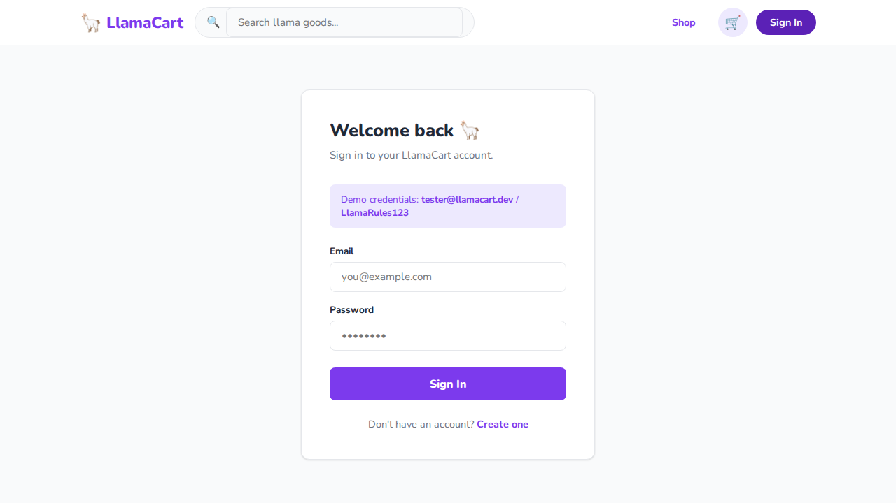
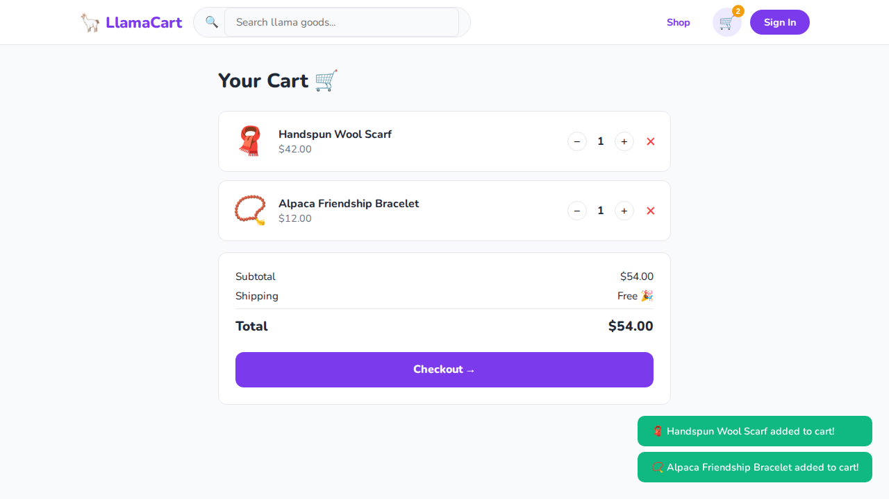

# 🦙 Chapter 3 — Fixtures & Page Object Model

> Stop repeating setup code. Start writing tests that read like English.

## What you'll learn

- Encapsulating selectors and actions with the **[Page Object Model](https://playwright.dev/docs/pom)** pattern
- Creating **[custom fixtures](https://playwright.dev/docs/test-fixtures#creating-a-fixture)** with [`test.extend()`](https://playwright.dev/docs/api/class-test#test-extend)
- Sharing pre-authenticated state with a `loggedInPage` fixture
- Fixture **teardown** — what runs after `use()`
- Using [`test.describe`](https://playwright.dev/docs/api/class-test#test-describe) and [`test.beforeEach`](https://playwright.dev/docs/api/class-test#test-before-each) alongside fixtures
- Scoping locators to avoid strict mode violations

## Prerequisites

- Node.js 18+
- Repo cloned and dependencies installed (`npm install` at root, `cd webapp && npm install`)
- Playwright browsers installed (`npx playwright install`)

See the [root README](../../README.md) for full setup instructions.

## Running the tests

```bash
# Run Chapter 3 on Chromium only (fastest)
npx playwright test tests/03-fixtures-and-pom --project=chromium

# Run with the interactive UI — great for watching fixture setup/teardown
npx playwright test tests/03-fixtures-and-pom --ui
```

---

## The two big ideas

### Page Object Model (POM)

A **Page Object** is a class that wraps a page (or section of a page) and exposes actions and queries as methods, hiding the raw selectors from your tests.

```
Without POM                          With POM
─────────────────────────────────    ─────────────────────────────────
await page.getByTestId('login-     await loginPage.login(
  email').fill(email);                email, password);
await page.getByTestId('login-
  password').fill(password);
await page.getByTestId('login-
  submit').click();
```

When a selector changes you fix it in one class, not across every test that touched it.

### Fixtures

A **fixture** is a function that sets up a piece of test state, hands it to the test via `use()`, and optionally tears it down afterwards. Playwright's `page`, `browser`, and `context` are all built-in fixtures. Chapter 3 shows you how to build your own.

```typescript
// Everything before use() = setup
// use(value) = the test runs here
// Everything after use() = teardown
loginPage: async ({ page }, use) => {
  const loginPage = new LoginPage(page);
  await loginPage.goto();      // ← setup
  await use(loginPage);        // ← test runs
  // ← teardown would go here
},
```

---

## The pages under test

The login form is inside a single-page app that renders both the **Login** and **Register** forms in the DOM at the same time — only one is shown at a time via CSS. This is why locators must be scoped carefully (more on that below).



The shop lists all 8 products. Each card has an "Add to Cart" button — but the featured section on the home page renders the same `data-testid="add-to-cart"` buttons in a hidden container. Tests that click "Add to Cart" must scope to `#page-shop` to avoid resolving to a hidden element.


The cart shows each item with quantity controls (− and +), a remove button, and a running total.



---

## POM class walkthrough

### `LoginPage` — [pages/LoginPage.ts](./pages/LoginPage.ts)

```typescript
export class LoginPage {
  readonly page: Page;

  constructor(page: Page) {
    this.page = page;
  }

  async goto() {
    await this.page.goto('/');
    await this.page.getByTestId('nav-login').click();
  }

  async login(email: string, password: string) {
    await this.page.getByTestId('login-email').fill(email);
    await this.page.getByTestId('login-password').fill(password);
    await this.page.getByTestId('login-submit').click();
  }

  async getErrorMessage() {
    return this.page.getByTestId('login-error');
  }

  async isLoggedIn() {
    return this.page.getByTestId('user-avatar').isVisible();
  }
}
```

`getByTestId('login-email')` is used instead of `getByLabel('Email')` because the login and register forms coexist in the DOM — both have an `<label>Email</label>`, so `getByLabel` would resolve to two elements and throw a strict mode violation. The `login-email` test ID is unique to the login form.

### `CartPage` — [pages/CartPage.ts](./pages/CartPage.ts)

`CartPage` wraps every interaction with the cart page into named methods:

| Method | What it does |
|---|---|
| `goto()` | Clicks the cart icon in the nav |
| `getItemCount()` | Returns the number of cart items |
| `getItemNames()` | Returns all item names as a string array |
| `increaseQty(name)` | Clicks `+` on the row matching `name` |
| `decreaseQty(name)` | Clicks `−` on the row matching `name` |
| `removeItem(name)` | Clicks the remove button on the row matching `name` |
| `getTotal()` | Returns the total price string |
| `checkout()` | Clicks the Checkout button |
| `isEmpty()` | Returns `true` if the empty-cart prompt is visible |

The `increaseQty`, `decreaseQty`, and `removeItem` methods use `.filter({ hasText: productName })` to find the right row by name — the same locator-chaining technique from Chapter 2.

---

## Test walkthrough

### Custom fixtures

```typescript
type LlamaFixtures = {
  loginPage: LoginPage;
  cartPage: CartPage;
  loggedInPage: LoginPage;
};

export const test = base.extend<LlamaFixtures>({

  loginPage: async ({ page }, use) => {
    const loginPage = new LoginPage(page);
    await loginPage.goto();
    await use(loginPage);
  },

  cartPage: async ({ page }, use) => {
    const cartPage = new CartPage(page);
    await use(cartPage);
  },

  loggedInPage: async ({ page }, use) => {
    const loginPage = new LoginPage(page);
    await loginPage.goto();
    await loginPage.login('tester@llamacart.dev', 'LlamaRules123');
    await use(loginPage);
  },

});
```

[`base.extend<LlamaFixtures>()`](https://playwright.dev/docs/api/class-test#test-extend) returns a new `test` object that includes all of Playwright's built-in fixtures *plus* the three new ones. Tests in this file import this `test` instead of the default one.

Each fixture receives the built-in `{ page }` fixture as a dependency — Playwright resolves the dependency graph automatically. A test that requests both `loginPage` and `cartPage` gets a single shared `page` instance injected into both.

---

### `describe` block 1 — Login using Page Object Model

#### Test 1 — "successful login with valid credentials"

```typescript
test('successful login with valid credentials', async ({ loginPage, page }) => {
  await loginPage.login('tester@llamacart.dev', 'LlamaRules123');
  await expect(page.getByTestId('user-avatar')).toBeVisible();
  await expect(page.getByTestId('toast')).toContainText('Welcome back');
});
```

`loginPage` is the custom fixture — by the time this test runs, `LoginPage.goto()` has already been called, so the login form is on screen. The test only needs to call `loginPage.login()` and then assert the result.

Notice that `page` is also destructured alongside `loginPage`. Fixtures can be mixed freely — `loginPage` sets the scene, `page` is used directly for the final assertions.

---

#### Test 2 — "failed login shows error message"

```typescript
test('failed login shows error message', async ({ loginPage }) => {
  await loginPage.login('wrong@example.com', 'wrongpassword');
  const error = await loginPage.getErrorMessage();
  await expect(error).toBeVisible();
  await expect(error).toContainText('Invalid email or password');
});
```

`getErrorMessage()` returns a **locator** (not a resolved value) — it doesn't check anything by itself. Returning the locator from the POM and asserting in the test keeps the POM free of assertion logic, which makes it reusable across tests with different expectations.

---

#### Test 3 — "empty form shows no error until submitted"

```typescript
test('empty form shows no error until submitted', async ({ loginPage }) => {
  const error = await loginPage.getErrorMessage();
  await expect(error).not.toBeVisible();
});
```

This test only uses the fixture for navigation and checks the initial state. The error element exists in the DOM at all times (it's hidden by CSS until a failed login), so `not.toBeVisible()` is the right assertion — `not.toBeInTheViewport()` or checking for absence in the DOM would both be wrong here.

#### Assignment — add a `waitForSuccessfulLogin` method

Add a method to `LoginPage` that encapsulates the post-login assertions, then use it in Test 1:

```typescript
// In LoginPage.ts
async waitForSuccessfulLogin() {
  await expect(this.page.getByTestId('user-avatar')).toBeVisible();
}
```

```typescript
// In the test
await loginPage.login('tester@llamacart.dev', 'LlamaRules123');
await loginPage.waitForSuccessfulLogin();
```

Run the test to confirm it still passes:

```bash
npx playwright test tests/03-fixtures-and-pom --project=chromium -g "successful login"
```

<details>
<summary>Solution</summary>

Add to `LoginPage.ts`:

```typescript
async waitForSuccessfulLogin() {
  await expect(this.page.getByTestId('user-avatar')).toBeVisible();
  await expect(this.page.getByTestId('toast')).toContainText('Welcome back');
}
```

Update Test 1:

```typescript
test('successful login with valid credentials', async ({ loginPage }) => {
  await loginPage.login('tester@llamacart.dev', 'LlamaRules123');
  await loginPage.waitForSuccessfulLogin();
});
```

Note that `page` is no longer needed in the test signature once all assertions move into the POM method. This is the goal of the POM pattern: tests describe *what* to do, POMs describe *how* to assert it.

</details>

---

### `describe` block 2 — Cart using fixtures and POM

This block uses a `test.beforeEach` alongside fixtures:

```typescript
test.describe('Cart — using fixtures and POM', () => {

  test.beforeEach(async ({ page }) => {
    await page.goto('/');
    await page.getByTestId('nav-shop').click();
  });

  // …tests…
});
```

`beforeEach` and fixtures are complementary. Fixtures are best for reusable, parameterisable state shared across many tests or files. `beforeEach` is best for simple navigation that only applies within one `describe` block.

---

#### Test 4 — "adding a product updates cart count"

```typescript
test('adding a product updates cart count', async ({ page, cartPage }) => {
  await page.locator('#page-shop').getByTestId('add-to-cart').first().click();
  const countBadge = page.locator('#cart-count');
  await expect(countBadge).toHaveText('1');
});
```

The locator is scoped to `#page-shop` rather than the full page. The home page's featured section also contains `data-testid="add-to-cart"` buttons, but those are inside a hidden container after navigating to the shop. Without the scope, `.first()` resolves to a hidden element and the click times out.

`cartPage` is declared in the fixture list even though it isn't used for an action here — it's available if needed without any extra setup cost.

---

#### Test 5 — "cart shows added items"

```typescript
test('cart shows added items', async ({ page, cartPage }) => {
  await page.getByTestId('product-card').nth(0).getByTestId('add-to-cart').click();
  await page.getByTestId('product-card').nth(1).getByTestId('add-to-cart').click();

  await cartPage.goto();

  const count = await cartPage.getItemCount();
  expect(count).toBe(2);
});
```

Here `cartPage.goto()` and `cartPage.getItemCount()` replace three raw locator calls. If the cart navigation or item selector ever changes, only `CartPage.ts` needs updating.

Note the mix of styles: the "add to cart" clicks use `page` directly (scoped per-card via `.nth()`), while the cart verification uses `cartPage`. Both are valid — use the POM for actions you repeat across multiple tests, and `page` directly for one-off interactions.

---

#### Test 6 — "quantity controls update cart total"

```typescript
test('quantity controls update cart total', async ({ page, cartPage }) => {
  const firstCard = page.getByTestId('product-card').first();
  const productName = await firstCard.getByTestId('product-name').textContent();
  await firstCard.getByTestId('add-to-cart').click();

  await cartPage.goto();
  const totalBefore = await cartPage.getTotal();

  await cartPage.increaseQty(productName!);
  const totalAfter = await cartPage.getTotal();

  expect(totalBefore).not.toEqual(totalAfter);
});
```

`cartPage.increaseQty(productName!)` uses the product name captured before clicking to find the right cart row via `.filter({ hasText: productName })`. Capturing a value before an action and using it to locate an element after is a reliable pattern for dynamic content.

`totalBefore` and `totalAfter` are compared with `not.toEqual` rather than checking a specific value — the test only needs to know the total changed, not what it changed to. This avoids hardcoding a price that could change.

#### Assignment — assert the exact doubled total

`increaseQty` bumps the quantity from 1 to 2, so the new total should be exactly double the original. Parse both totals as numbers and assert that `totalAfter === totalBefore * 2`:

```typescript
const toNumber = (s: string | null) => parseFloat(s!.replace('$', ''));
expect(toNumber(totalAfter)).toBe(toNumber(totalBefore) * 2);
```

Run the test:

```bash
npx playwright test tests/03-fixtures-and-pom --project=chromium -g "quantity controls"
```

<details>
<summary>Solution</summary>

Replace the final assertion:

```typescript
const toNumber = (s: string | null) => parseFloat(s!.replace(/[^0-9.]/g, ''));
expect(toNumber(totalAfter)).toBeCloseTo(toNumber(totalBefore) * 2, 2);
```

`toBeCloseTo` handles floating-point rounding (e.g. `$12.00 * 2 = $24.000000000000004`). This assertion is stricter than `not.toEqual` — it will catch a bug where the total changes by the wrong amount, not just any change.

</details>

---

#### Test 7 — "removing an item from cart empties it"

```typescript
test('removing an item from cart empties it', async ({ page, cartPage }) => {
  const firstCard = page.getByTestId('product-card').first();
  const productName = await firstCard.getByTestId('product-name').textContent();
  await firstCard.getByTestId('add-to-cart').click();

  await cartPage.goto();
  await cartPage.removeItem(productName!);

  expect(await cartPage.isEmpty()).toBe(true);
});
```

`cartPage.isEmpty()` calls `isVisible()` on the empty-cart prompt rather than asserting `getItemCount() === 0`. This tests the visible empty state the user actually sees, not just that the list is technically empty.

---

### `describe` block 3 — Logged-in user flow

#### The `loggedInPage` fixture

```typescript
loggedInPage: async ({ page }, use) => {
  const loginPage = new LoginPage(page);
  await loginPage.goto();
  await loginPage.login('tester@llamacart.dev', 'LlamaRules123');
  await use(loginPage);
},
```

Any test that requests `loggedInPage` starts already authenticated — no repeated login boilerplate. This is the simplest form of **auth state setup** as a fixture. Chapter 5 shows a more efficient approach using saved storage state that skips the login UI entirely.

---

#### Test 8 — "logged-in user sees avatar in nav"

```typescript
test('logged-in user sees avatar in nav', async ({ loggedInPage, page }) => {
  await expect(page.getByTestId('user-avatar')).toBeVisible();
});
```

The fixture does all the work. The test body is a single assertion — which is the point. When you can state the intent in one line, the test is easy to read, easy to debug, and easy to maintain.

---

#### Test 9 — "logged-in user can add to cart and checkout"

```typescript
test('logged-in user can add to cart and checkout', async ({ loggedInPage, page, cartPage }) => {
  await page.getByTestId('nav-shop').click();
  await page.locator('#page-shop').getByTestId('add-to-cart').first().click();

  await cartPage.goto();
  await cartPage.checkout();

  await expect(page.getByText('Order placed!')).toBeVisible();
});
```

Three fixtures cooperate in a single test: `loggedInPage` handles authentication, `cartPage` handles cart navigation and checkout, and `page` handles the shop navigation and final assertion. Playwright ensures all three share the same browser context.

#### Assignment — write a test for the empty cart state

Using the `loggedInPage` fixture, write a new test that verifies a logged-in user sees the empty cart prompt when they open the cart without adding anything:

```typescript
test('logged-in user sees empty cart initially', async ({ loggedInPage, page, cartPage }) => {
  // Your test here
});
```

<details>
<summary>Solution</summary>

```typescript
test('logged-in user sees empty cart initially', async ({ loggedInPage, page, cartPage }) => {
  await cartPage.goto();
  expect(await cartPage.isEmpty()).toBe(true);
});
```

The `loggedInPage` fixture navigates and logs in, so the test only needs to open the cart and check. If you want to assert the empty-state message text as well:

```typescript
await expect(page.getByTestId('empty-cart-shop-btn')).toBeVisible();
```

</details>

---

#### Assignment — trigger a strict mode violation, then fix it

Understanding *why* scoping matters is as useful as knowing how to do it. This assignment recreates the bug that was in `LoginPage.ts` before the fix.

1. Open [pages/LoginPage.ts](./pages/LoginPage.ts) and temporarily change the `login` method to use `getByLabel`:

   ```typescript
   async login(email: string, password: string) {
     await this.page.getByLabel('Email').fill(email);  // ← ambiguous
     await this.page.getByLabel('Password').fill(password);
     await this.page.getByTestId('login-submit').click();
   }
   ```

2. Run the login tests:

   ```bash
   npx playwright test tests/03-fixtures-and-pom --project=chromium -g "Login"
   ```

3. Read the strict mode violation error — notice it lists both matching elements.

4. Restore the fix. There are two valid approaches:
   - Use `getByTestId('login-email')` (unique ID)
   - Scope first: `this.page.locator('#page-login').getByLabel('Email')`

<details>
<summary>Solution</summary>

Both approaches resolve the ambiguity. Scoping with `#page-login`:

```typescript
async login(email: string, password: string) {
  const form = this.page.locator('#page-login');
  await form.getByLabel('Email').fill(email);
  await form.getByLabel('Password').fill(password);
  await this.page.getByTestId('login-submit').click();
}
```

Using `getByTestId` (the approach in the actual code):

```typescript
async login(email: string, password: string) {
  await this.page.getByTestId('login-email').fill(email);
  await this.page.getByTestId('login-password').fill(password);
  await this.page.getByTestId('login-submit').click();
}
```

`getByTestId` is simpler here because the IDs are already unique. The `locator('#page-login')` scoping approach is more useful when you want to keep using semantic locators (`getByLabel`, `getByRole`) and the uniqueness comes from the container rather than the element itself.

</details>

---

## Summary

| Test | Fixture used | Key concept |
|---|---|---|
| 1 — successful login | `loginPage` | POM hides selectors; fixture handles navigation |
| 2 — failed login | `loginPage` | POM returns locators, not values |
| 3 — empty form state | `loginPage` | `not.toBeVisible()` on a hidden element |
| 4 — cart count updates | `page`, `cartPage` | Scope `#page-shop` to avoid hidden duplicates |
| 5 — cart shows added items | `page`, `cartPage` | Mix `page` and POM methods in one test |
| 6 — quantity updates total | `page`, `cartPage` | Capture before action, assert after |
| 7 — remove empties cart | `page`, `cartPage` | Assert visible empty state, not zero count |
| 8 — avatar after login | `loggedInPage` | Fixture as auth state; one-line test body |
| 9 — add to cart and checkout | `loggedInPage`, `page`, `cartPage` | Three fixtures cooperating |

### Locator strategies used in this chapter

| Situation | Locator used | Why |
|---|---|---|
| Login email input | `getByTestId('login-email')` | Two "Email" labels in the DOM — test ID is unique |
| Cart item row by name | `.filter({ hasText: name })` | Dynamic list; name is the stable identifier |
| Add to Cart in shop | `locator('#page-shop').getByTestId(…)` | Same test ID exists in hidden home-page section |
| Error message | `getByTestId('login-error')` | Element always in DOM; hidden by CSS until needed |
