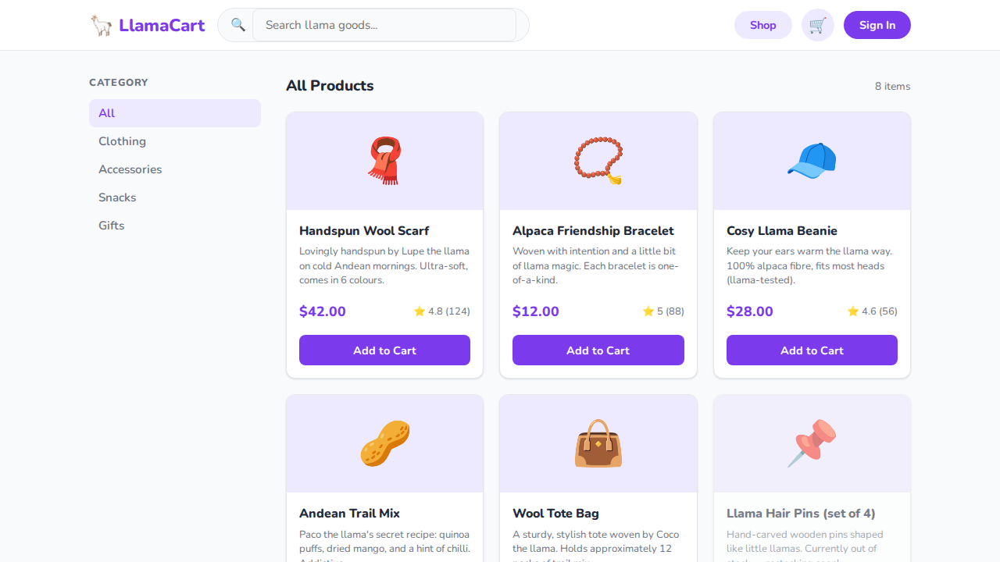
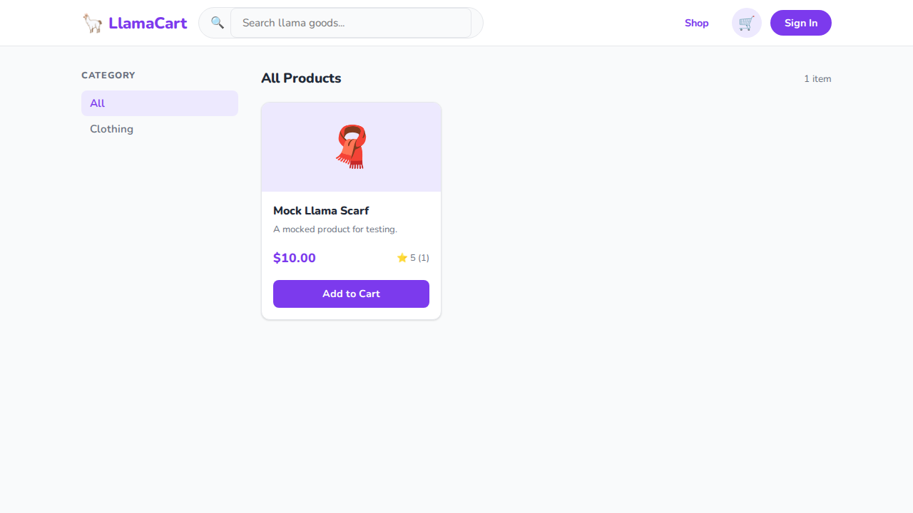
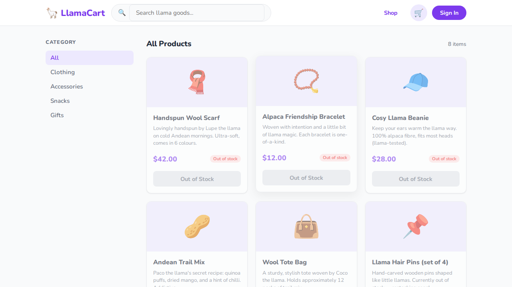
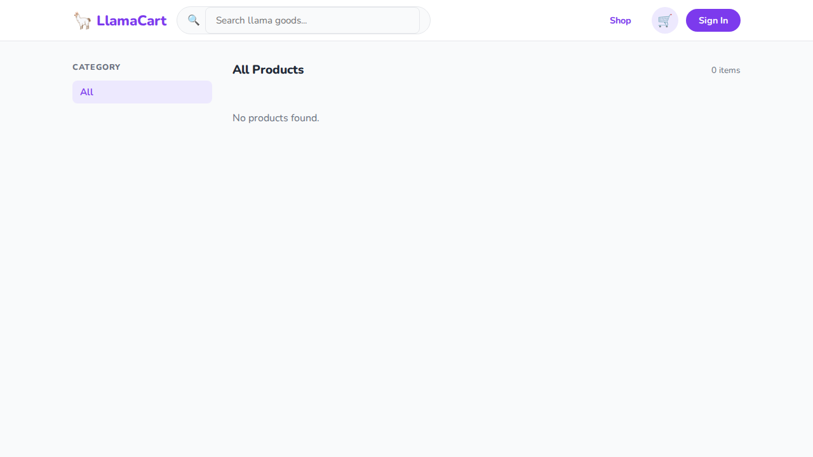

# 🦙 Chapter 4 — Network Mocking & API Interception

> Take control of the backend from inside your test. No server changes required.

## What you'll learn

- Intercepting requests with [`page.route()`](https://playwright.dev/docs/api/class-page#page-route)
- The three things you can do with a route: **fulfill**, **abort**, **continue**
- Observing requests with [`page.on('request')`](https://playwright.dev/docs/api/class-page#page-event-request) and [`page.waitForRequest()`](https://playwright.dev/docs/api/class-page#page-wait-for-request)
- Fetching a real response and modifying it before the browser sees it
- Simulating network failures and slow connections
- Route registration order and how Playwright picks the winner (LIFO)
- Recording and replaying real traffic with [HAR files](https://playwright.dev/docs/api/class-browsercontext#browser-context-route-from-har)

## Prerequisites

- Node.js 18+
- Repo cloned and dependencies installed (`npm install` at root, `cd webapp && npm install`)
- Playwright browsers installed (`npx playwright install`)

See the [root README](../../README.md) for full setup instructions.

## Running the tests

```bash
# Run Chapter 4 on Chromium only (fastest)
npx playwright test tests/04-api-and-network --project=chromium

# Run with the interactive UI — watch each route fire in real time
npx playwright test tests/04-api-and-network --ui
```

---

## Core concepts

### `page.route(pattern, handler)`

The entry point for all network control. The `pattern` can be:

```typescript
page.route('**/products.js', handler)          // glob
page.route(/api\/products/, handler)           // regex
page.route('https://example.com', handler)     // exact URL
```

### The three things you can do with a route

```typescript
// 1. Fulfill — respond with your own data
await route.fulfill({
  status: 200,
  contentType: 'application/json',
  body: JSON.stringify({ data: 'mocked' }),
});

// 2. Abort — simulate a network failure
await route.abort('failed'); // or 'blockedbyclient', 'connectionrefused'

// 3. Continue — pass through, optionally modified
await route.continue({
  headers: { ...route.request().headers(), 'x-test': 'true' },
});
```

### Fetch + modify a real response

```typescript
await page.route('**/products.js', async route => {
  const response = await route.fetch();   // make the real request
  let body = await response.text();

  body = body.replace(/inStock: true/g, 'inStock: false');

  await route.fulfill({ response, body }); // forward with patch applied
});
```

### Route registration order

Playwright resolves routes in **LIFO order** — the last registered handler wins. Register specific overrides *after* catch-all handlers so they take precedence.

---

## The page under test

The shop page lists all 8 products. Each card has an **Add to Cart** button when the product is in stock, or an **Out of Stock** badge and disabled button when it isn't. The product data lives in a static `products.js` file — which makes it a perfect interception target for every test in this chapter.



When `route.fulfill()` replaces the products file with a custom response, the shop renders only the mocked data — in this case a single test product:



When the response is fetched and patched to set every `inStock` flag to `false`, every card changes from "Add to Cart" to a disabled "Out of Stock" button:



When an empty products array is returned, the shop renders the empty state:



---

## Test walkthrough

### `describe` block 1 — Network mocking

---

#### Test 1 — "observe: log all requests the app makes on load"

```typescript
test('observe: log all requests the app makes on load', async ({ page }) => {
  const requests: string[] = [];

  page.on('request', req => requests.push(req.url()));

  await page.goto('/');

  expect(requests.some(url => url.includes('localhost'))).toBe(true);
});
```

`page.on('request', ...)` fires for every request the browser makes after the listener is registered — so it must be set up *before* navigation. The callback runs synchronously as each request fires, pushing URLs into the array. After `goto` resolves, the array contains the full load-time request list.

`page.on` is a one-way listener: it observes but cannot intercept. Use `page.route()` when you need to modify or block a request.

---

#### Test 2 — "observe: capture a specific request and assert its method"

```typescript
test('observe: capture a specific request and assert its method', async ({ page }) => {
  await page.goto('/');

  const [request] = await Promise.all([
    page.waitForRequest(req =>
      req.url().includes('localhost') && req.method() === 'GET'),
    page.reload(),
  ]);

  expect(request.method()).toBe('GET');
});
```

`page.waitForRequest()` returns a Promise that resolves with the first request matching the predicate. The `Promise.all` pattern is essential — start listening *before* the action that triggers the request, then trigger it. Starting the listener after the trigger creates a race condition where the request may already have fired before the listener is attached.

#### Assignment — assert the URL of the intercepted request

Extend this test to also assert that the captured request URL ends with `/` (the root page):

```typescript
expect(request.url()).toMatch(/localhost:\d+\/$/);
```

Run it:

```bash
npx playwright test tests/04-api-and-network --project=chromium -g "capture a specific request"
```

<details>
<summary>Solution</summary>

```typescript
test('observe: capture a specific request and assert its method', async ({ page }) => {
  await page.goto('/');

  const [request] = await Promise.all([
    page.waitForRequest(req =>
      req.url().includes('localhost') && req.method() === 'GET'),
    page.reload(),
  ]);

  expect(request.method()).toBe('GET');
  expect(request.url()).toMatch(/localhost:\d+\/$/);
});
```

The regex `localhost:\d+\/$` matches any localhost port followed by a trailing `/`. `\d+` avoids hardcoding the port number, which can vary between machines and CI environments.

</details>

---

#### Test 3 — "mock: intercept products data with a custom response"

```typescript
test('mock: intercept products data with a custom response', async ({ page }) => {
  await page.route('**/products.js', async route => {
    await route.fulfill({
      status: 200,
      contentType: 'application/javascript',
      body: `
        export const products = [
          { id: 99, name: "Mock Llama Scarf", price: 10.00, category: "clothing",
            emoji: "🧣", rating: 5.0, reviews: 1, inStock: true,
            description: "A mocked product for testing.", tags: ["mock"] }
        ];
        export const categories = ["all", "clothing"];
        export const DEMO_USER = { ... };
      `,
    });
  });

  await page.goto('/');
  await page.getByTestId('hero-shop-btn').click();

  await expect(page.getByTestId('product-card')).toHaveCount(1);
  await expect(page.getByTestId('product-name').first()).toContainText('Mock Llama Scarf');
});
```

The route handler fires instead of the real network request — the browser never reaches the server. The `body` must be valid JavaScript that the app can import, including all exports the app expects (`products`, `categories`, `DEMO_USER`). Omitting any of them would cause a runtime error in the app.

`page.route()` must be called before the navigation that triggers the request. Setting it up after `goto` would be too late.

#### Assignment — return three mock products and assert the count

Change the mock to return three products with different names, then assert `toHaveCount(3)`:

```bash
npx playwright test tests/04-api-and-network --project=chromium -g "intercept products"
```

<details>
<summary>Solution</summary>

```typescript
await page.route('**/products.js', async route => {
  await route.fulfill({
    status: 200,
    contentType: 'application/javascript',
    body: `
      export const products = [
        { id: 1, name: "Mock Scarf",   price: 10, category: "clothing", emoji: "🧣",
          rating: 5, reviews: 1, inStock: true, description: "Mock.", tags: [] },
        { id: 2, name: "Mock Hat",     price: 20, category: "clothing", emoji: "🎩",
          rating: 4, reviews: 2, inStock: true, description: "Mock.", tags: [] },
        { id: 3, name: "Mock Mittens", price: 15, category: "clothing", emoji: "🧤",
          rating: 3, reviews: 0, inStock: true, description: "Mock.", tags: [] },
      ];
      export const categories = ["all", "clothing"];
      export const DEMO_USER = { email: "tester@llamacart.dev", password: "LlamaRules123", name: "Alex Llama" };
    `,
  });
});

await page.goto('/');
await page.getByTestId('hero-shop-btn').click();

await expect(page.getByTestId('product-card')).toHaveCount(3);
```

</details>

---

#### Test 4 — "failure: abort a request to simulate network error"

```typescript
test('failure: abort a request to simulate network error', async ({ page }) => {
  let requestAborted = false;

  await page.route('**/products.js', async route => {
    requestAborted = true;
    await route.abort('failed');
  });

  await page.goto('/');
  expect(requestAborted).toBe(true);
});
```

`route.abort('failed')` tells the browser the connection failed — equivalent to pulling the network cable. The abort reason (`'failed'`, `'connectionrefused'`, `'blockedbyclient'`) is visible in DevTools and can influence how the app handles the error.

This test only verifies that the route fired. In a production test, you'd also assert that the UI shows a user-friendly error state rather than an unhandled JavaScript crash.

#### Assignment — assert the app still renders after a network failure

Add an assertion that the page body is still visible and contains some expected text after the products request is aborted:

```typescript
await expect(page.getByTestId('nav-shop')).toBeVisible();
```

<details>
<summary>Solution</summary>

```typescript
test('failure: abort a request to simulate network error', async ({ page }) => {
  let requestAborted = false;

  await page.route('**/products.js', async route => {
    requestAborted = true;
    await route.abort('failed');
  });

  await page.goto('/');
  expect(requestAborted).toBe(true);

  // The app should still render its shell
  await expect(page.getByTestId('nav-shop')).toBeVisible();
});
```

If the app crashed or showed a blank screen on a failed request, this assertion would catch it. This kind of resilience test is especially valuable for apps that rely on third-party APIs that can go down unexpectedly.

</details>

---

#### Test 5 — "failure: simulate slow network with artificial delay"

```typescript
test('failure: simulate slow network with artificial delay', async ({ page }) => {
  await page.route('**/products.js', async route => {
    await new Promise(res => setTimeout(res, 1000));
    await route.continue();
  });

  const start = Date.now();
  await page.goto('/');
  const elapsed = Date.now() - start;

  expect(elapsed).toBeGreaterThan(900);
});
```

Delaying inside the route handler pauses the request for the specified time before passing it through with `route.continue()`. The 100ms buffer (`900` vs `1000`) accounts for timer imprecision — `Date.now()` before `goto` and after `goto` includes page processing time, not just the delay.

Slow-network tests are most useful for verifying loading states: does the app show a spinner? Does it block interaction? Does it eventually load correctly? This test only measures elapsed time; combine it with a loading-indicator assertion for fuller coverage.

---

#### Test 6 — "modify: mark all products as out of stock"

```typescript
test('modify: mark all products as out of stock', async ({ page }) => {
  await page.route('**/products.js', async route => {
    const response = await route.fetch();
    let body = await response.text();

    body = body.replace(/inStock: true/g, 'inStock: false');

    await route.fulfill({ response, body });
  });

  await page.goto('/');
  await page.getByTestId('hero-shop-btn').click();

  const addButtons = page.getByTestId('add-to-cart');
  const count = await addButtons.count();
  for (let i = 0; i < count; i++) {
    await expect(addButtons.nth(i)).toBeDisabled();
  }
});
```

`route.fetch()` makes the real network request and returns the response — so the data stays up to date even as the codebase evolves. The body is modified with a string replace before being handed back to the browser via `route.fulfill({ response, body })`. Passing `response` alongside `body` preserves the original status, headers, and content-type from the real response.

The for-loop assertion checks every button individually. Playwright doesn't have a built-in "assert all elements match a condition" helper, so iterating by index is the idiomatic approach.

#### Assignment — assert that out-of-stock badges are visible

When a product is out of stock, LlamaCart renders an "Out of stock" badge on the card. Add an assertion that verifies these badges appear after the patch:

```bash
npx playwright test tests/04-api-and-network --project=chromium -g "mark all products"
```

<details>
<summary>Solution</summary>

Inspect the shop page to find the badge test ID. In LlamaCart, out-of-stock cards render a badge alongside the disabled button:

```typescript
const outOfStockBadges = page.getByText('Out of stock');
const badgeCount = await outOfStockBadges.count();
expect(badgeCount).toBeGreaterThan(0);
```

Or, to assert every card has a badge (count should equal product count):

```typescript
const cardCount = await page.getByTestId('product-card').count();
const badgeCount = await page.getByText('Out of stock').count();
expect(badgeCount).toBe(cardCount);
```

This assertion is stronger — it confirms *all* products are out of stock, not just that at least one badge appeared.

</details>

---

#### Test 7 — "selective: only mock one product category"

```typescript
test('selective: only mock one product category', async ({ page }) => {
  let intercepted = false;

  await page.route('**/products.js', async route => {
    intercepted = true;
    await route.continue();
  });

  await page.goto('/');
  await page.getByTestId('nav-shop').click();

  await page.getByTestId('filter-clothing').click();

  expect(intercepted).toBe(true);
  const cards = page.getByTestId('product-card');
  await expect(cards.first()).toBeVisible();
});
```

This test uses `route.continue()` to let the real request pass through unmodified, while using the route callback as a side-effect spy via the `intercepted` flag. The pattern is useful for verifying that an app *does* make a specific request, without caring about the response content.

The clothing filter is applied after the initial load — `products.js` was already intercepted on `goto`. In a real app with paginated or filtered API calls, you'd register a new route after the first navigation to intercept the filtered fetch separately.

---

#### Test 8 — "assert: app shows correct price from data"

```typescript
test('assert: app shows correct price from data', async ({ page }) => {
  await page.goto('/');
  await page.getByTestId('nav-shop').click();

  const priceText = await page.getByTestId('product-price').first().textContent();
  expect(priceText).toMatch(/^\$\d+\.\d{2}$/);
});
```

No routing here — this test uses the real data to verify the app formats prices correctly. The regex `/^\$\d+\.\d{2}$/` is more useful than asserting a hardcoded value like `'$42.00'`: it will catch formatting bugs (missing `$`, wrong decimal places) without breaking every time product data changes.

Pairing route mocking tests with format assertion tests like this is a healthy pattern: the mock tests control the data, the format tests verify the rendering.

#### Assignment — assert all visible prices match the format

The first-price assertion only checks one card. Extend it to assert every price on the page matches the format:

```bash
npx playwright test tests/04-api-and-network --project=chromium -g "correct price"
```

<details>
<summary>Solution</summary>

```typescript
test('assert: app shows correct price from data', async ({ page }) => {
  await page.goto('/');
  await page.getByTestId('nav-shop').click();

  const prices = page.getByTestId('product-price');
  const count = await prices.count();

  for (let i = 0; i < count; i++) {
    const text = await prices.nth(i).textContent();
    expect(text).toMatch(/^\$\d+\.\d{2}$/);
  }
});
```

This is the same loop pattern used in Test 6. If you see a future test asserting multiple elements, reach for this idiom before reaching for a custom helper.

</details>

---

#### Test 9 — "route priority: more specific routes take precedence"

```typescript
test('route priority: more specific routes take precedence', async ({ page }) => {
  // Both routes match, but Playwright resolves in LIFO order
  await page.route('**/*.js', route => route.continue());
  await page.route('**/products.js', async route => {
    await route.fulfill({
      status: 200,
      contentType: 'application/javascript',
      body: `
        export const products = [];
        export const categories = ["all"];
        export const DEMO_USER = { ... };
      `,
    });
  });

  await page.goto('/');
  await page.getByTestId('hero-shop-btn').click();
  await expect(page.getByText('No products found.')).toBeVisible();
});
```

Playwright resolves routes in **LIFO order** (Last In, First Out). The `**/products.js` handler was registered second, so it wins over the `**/*.js` catch-all registered first — even though `**/*.js` is broader. The result: `products.js` is fulfilled with an empty array, while all other `.js` files pass through normally.

This matters in `test.beforeEach` setups where a catch-all is registered globally and specific tests need to override one endpoint.

---

#### Test 10 — "pattern: stub a login API endpoint"

```typescript
test('pattern: stub a login API endpoint', async ({ page }) => {
  let loginCalled = false;

  await page.route('**/api/login', async route => {
    loginCalled = true;

    if (route.request().method() === 'POST') {
      const body = route.request().postDataJSON();

      if (body?.email === 'admin@llamacart.dev') {
        await route.fulfill({
          status: 200,
          contentType: 'application/json',
          body: JSON.stringify({ token: 'mock-jwt-token', name: 'Admin Llama' }),
        });
      } else {
        await route.fulfill({
          status: 401,
          contentType: 'application/json',
          body: JSON.stringify({ error: 'Invalid credentials' }),
        });
      }
    }
  });

  await page.goto('/');
  expect(loginCalled).toBe(false); // expected for our static app
});
```

LlamaCart uses `localStorage` for auth, so `**/api/login` never fires. The test exists as a **reference pattern** for real apps with REST or GraphQL backends.

The key ideas:
- `route.request().method()` — check HTTP method before acting
- `route.request().postDataJSON()` — parse the request body as JSON
- Return different status codes (`200` vs `401`) based on the request content

In practice, this pattern lets you test both the happy path (valid credentials → dashboard) and the error path (wrong credentials → error message) without a running backend.

---

### `describe` block 2 — HAR recording

#### Test 11 — "record network as HAR file"

```typescript
test('record network as HAR file', async ({ page, context }) => {
  await context.routeFromHAR('./tests/04-api-and-network/llamacart.har', {
    update: true,   // record mode; set to false to replay
    url: /localhost/,
  });

  await page.goto('/');
});
```

A **HAR file** (HTTP Archive) records real network traffic — request URLs, methods, headers, and response bodies — to a JSON file. `context.routeFromHAR()` with `update: true` records on the first run; with `update: false` (or omitted) it replays the saved responses without hitting the network.

HAR files are most valuable for third-party APIs (Stripe, Algolia, Google Maps) — record real responses once, replay them in CI without rate limits or API keys. They're also useful for locking data for visual regression tests.

The `url` option scopes recording to requests matching the pattern. In this case `localhost` only — no CDN or analytics traffic ends up in the file.

#### Assignment — replay the HAR and assert the shop still loads

The `llamacart.har` file is already recorded in this repo (run with `update: true` once to create it). Write a new test that replays it with `update: false` and asserts the shop shows products:

```bash
npx playwright test tests/04-api-and-network --project=chromium -g "replay HAR"
```

<details>
<summary>Solution</summary>

```typescript
test('replay: serve shop from HAR file', async ({ page, context }) => {
  await context.routeFromHAR('./tests/04-api-and-network/llamacart.har', {
    update: false,
    url: /localhost/,
  });

  await page.goto('/');
  await page.getByTestId('hero-shop-btn').click();

  await expect(page.getByTestId('product-card').first()).toBeVisible();
});
```

With `update: false`, no network request reaches the server — the HAR file provides every response. This is the fastest possible test: it never depends on the dev server being up or products data being correct.

</details>

---

## Summary

| Test | Technique | Key concept |
|---|---|---|
| 1 — log all requests | `page.on('request')` | Listener must be registered before navigation |
| 2 — capture a specific request | `page.waitForRequest()` + `Promise.all` | Start waiting before the action that triggers the request |
| 3 — intercept products data | `route.fulfill()` | Replace entire response; include all exports the app needs |
| 4 — abort a request | `route.abort('failed')` | Simulates connection failure; test resilience, not just success |
| 5 — slow network | `setTimeout` + `route.continue()` | Delay then pass through; useful for testing loading states |
| 6 — mark all out of stock | `route.fetch()` + text patch + `route.fulfill()` | Fetch real response, modify, return; preserves headers |
| 7 — selective intercept | `route.continue()` as spy | Use route callback as a side-effect observer |
| 8 — assert price format | regex on `textContent()` | Format assertions catch rendering bugs without hardcoding values |
| 9 — route priority | LIFO registration order | Last registered wins; use this to override catch-alls in `beforeEach` |
| 10 — stub login API | `postDataJSON()` + conditional fulfill | Pattern for mocking REST endpoints with request-dependent responses |
| 11 — HAR recording | `context.routeFromHAR()` | Record once, replay forever; ideal for third-party APIs |

### When to reach for each technique

| Scenario | Technique |
|---|---|
| API is flaky or slow in CI | `route.fulfill()` with static data |
| Test error states (500, 404, network down) | `route.fulfill({ status: 500 })` / `route.abort()` |
| Test loading spinners or skeleton screens | `setTimeout` delay before `route.continue()` |
| Assert your app sends the right request | `page.waitForRequest()` + assert `.method()`, `.postDataJSON()` |
| Lock data for visual regression tests | HAR file with `update: false` |
| Override one endpoint without mocking everything | Register specific route after catch-all (LIFO wins) |
| Third-party APIs in CI (Stripe, Algolia) | HAR file — record once, no API keys needed |
